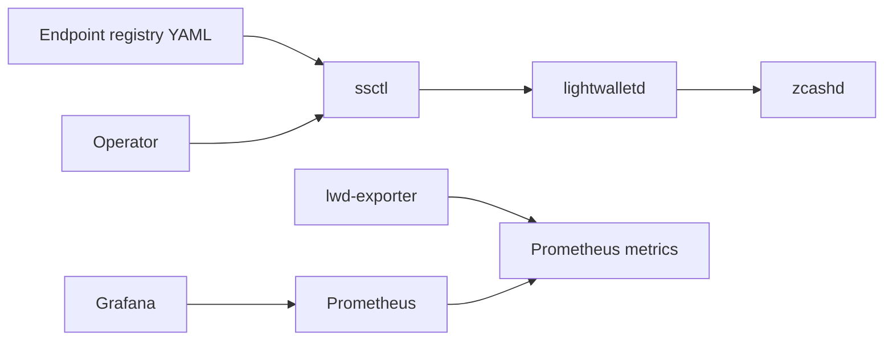

# Architecture

Shielded Stack is split into short-lived tooling and long-running services.

## Components

- `ssctl`: a Rust CLI for endpoint health checks, registry validation, and benchmarks.
- `lwd-client`: Rust primitives for endpoint metadata, registry parsing, and generated `lightwalletd` gRPC probes.
- `bench`: Rust benchmark primitives for repeated endpoint probes.
- `lwd-exporter`: a Go HTTP service that exposes health probes and Prometheus metrics.

## MVP Data Flow

## Runtime Checks

`ssctl health` calls `CompactTxStreamer/GetLightdInfo` and reports:

- endpoint URL and network
- reachability
- latest block height
- latency in milliseconds
- vendor, version, and chain name when returned by the server

`ssctl registry probe` loads the YAML registry format used by the operations repository and probes each active endpoint.

## Design Notes

- Rust is used for local tooling where strict types and fast binaries are useful.
- Go is used for long-running HTTP services and operational probes.
- Deployment files are kept close to the code so local and production paths stay aligned.
- Registry files remain in the operations repository so endpoint changes are public and reviewable.
