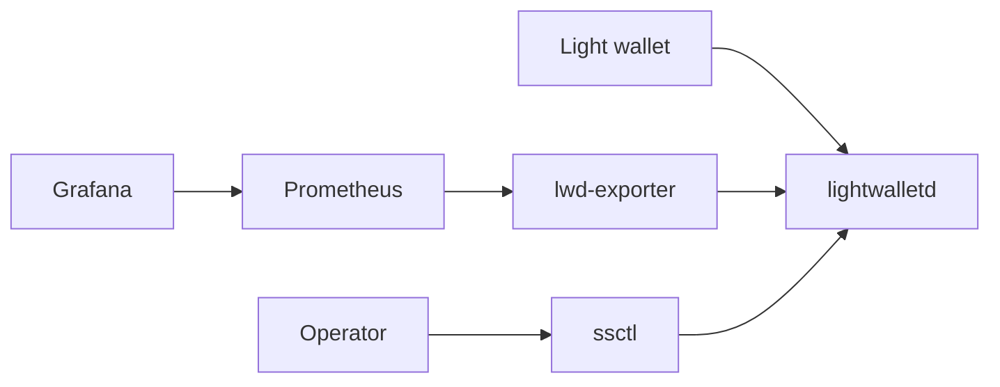

# Architecture

Shielded Stack is split into short-lived tooling and long-running services.

## Components

- `ssctl`: a Rust CLI for endpoint validation, checks, and benchmark commands.
- `lwd-client`: Rust primitives for representing and validating lightwalletd endpoints.
- `bench`: Rust benchmark primitives for endpoint test plans.
- `lwd-exporter`: a Go HTTP service that exposes health probes and Prometheus metrics.

## Data Flow

## Design Notes

- Rust is used for local tooling where strict types and fast binaries are useful.
- Go is used for long-running HTTP services and operational probes.
- Deployment files are kept close to the code so local and production paths stay aligned.

